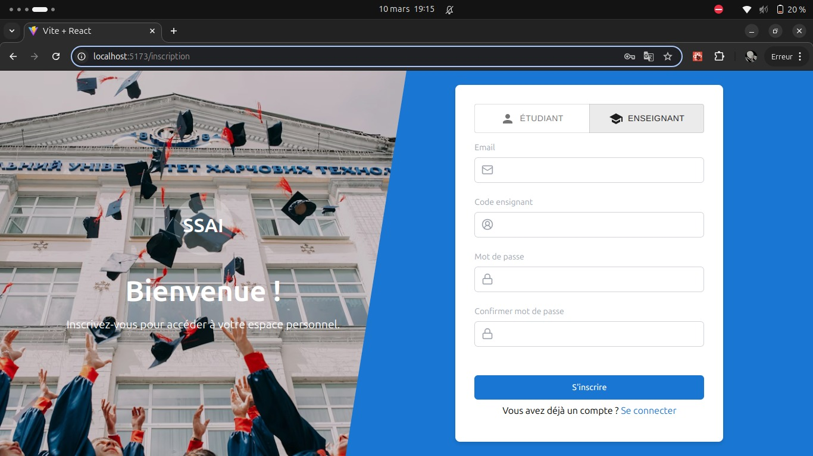

<h2>DEMO</h2>
<h2>LANDING PAGE</h2>
<table>
    <tr>
        <td></td>
        <td></td>
        <td></td>
    </tr>
    <tr>
        <td></td>
        <td></td>
        <td></td>
    </tr>
    <tr>
        <td></td>
        <td></td>
        <td></td>
    </tr>
    <tr>
        <td></td>
        <td></td>
        <td></td>
    </tr>
</table>

<h2>CHATBOT POUR LES ETUDIANTS 🤖</h2>

Afin de pouvoir avoir des éclaircissements sur les sujets d'examen ou les corrections, les etudiant disposent d'un chatbot avec lequel ils pourront interagir pour repondre a leurs questions. Ce chatbot utilise l'intelligence artificielle deepseek_v3 via l'api de "OpenRouter". Ci-dessus une apercu de ce à quoi ressemble l'interface :

<h2>PAGE INSCRIPTION ✍️</h2>

Le fichier FRONTEND/src/PAGES/Inscription.jsx represente la page d'inscription de tout utilisateur du site.  Vous pouvez voir l'illustration avec les images ci-apres  

  <table> 
      <tr>
        <td>  </td>
        <td>  </td>
      </tr>
  </table>
  <h2>PAGE CONNEXION 🔑</h2>

Le fichier FRONTEND/src/PAGES/Connexion.jsx represente la page de connexion de tout utilisateur du site.  Vous pouvez voir l'illustration avec les images ci-apres  

  <table> 
      <tr>
        <td>  </td>
        <td>  </td>
      </tr>
  </table>
<h1>DOCUMENTATION</h1>
<h2>BASE DE DONNEES 🚀</h2>

Le fichier db_schema.sql contient le script SQL permettant de créer la base de données et ses tables.   Vous pouvez regarder l'image "GestionExamens.png" pour une visualisation de la BD et "PROCEDURES_STOCKEES.png" pour avoir une appercu des procedures deja implementees au niveau de la bd

Test deploiement CI/CD ...

